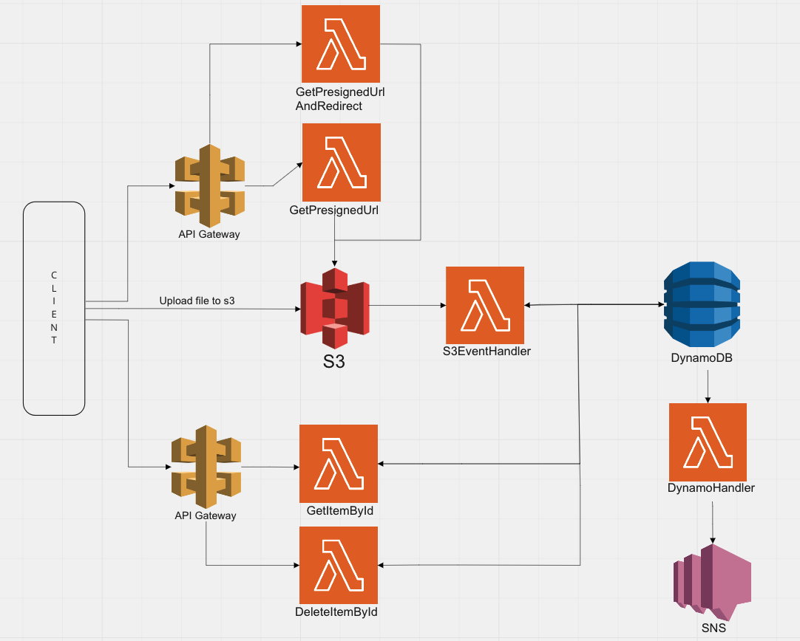

Lambda with S3 trigger that inserts data in Dynamo DB:

Prerequisites: 
1. Create bucket in S3
2. Create Lambda function in same region as S3 bucket with permission to get Object from S3 bucket 
and full access for Dynamo DB
3. Create S3 trigger for lambda (use S3 bucket name from step 1 and add suffix .json)
4. Create Dynamo db table: users with partitioning key: id
5. Create Dynamo db table: phone_numbers with partitioning key: phoneNumber

Build jar and deploy:
1. Open terminal and run: mvn clean install
2. Upload (uber) jar from target folder to aws lambda 

Testing:
1. Upload file from resources folder (test.json) to S3 bucket (from step 1)
2. Open Dynamo DB tables (users and phone_numbers) and check if there is data from json file

View logs from lambda:
Open cloudwatch -> Log group -> find your lambda

