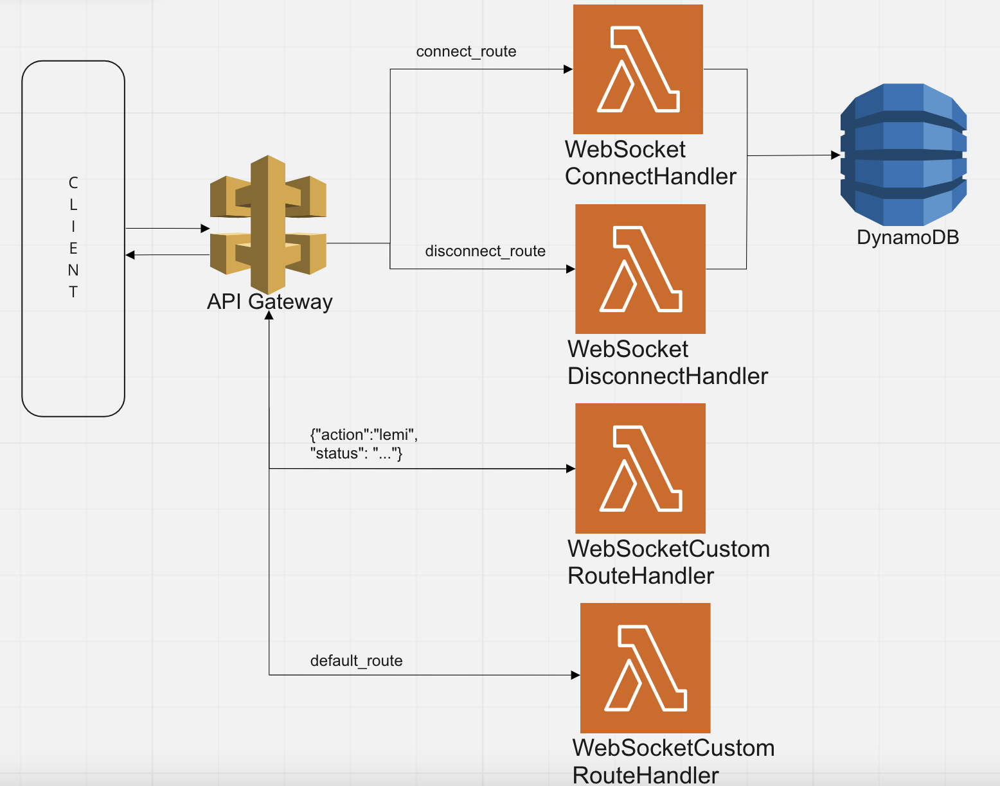
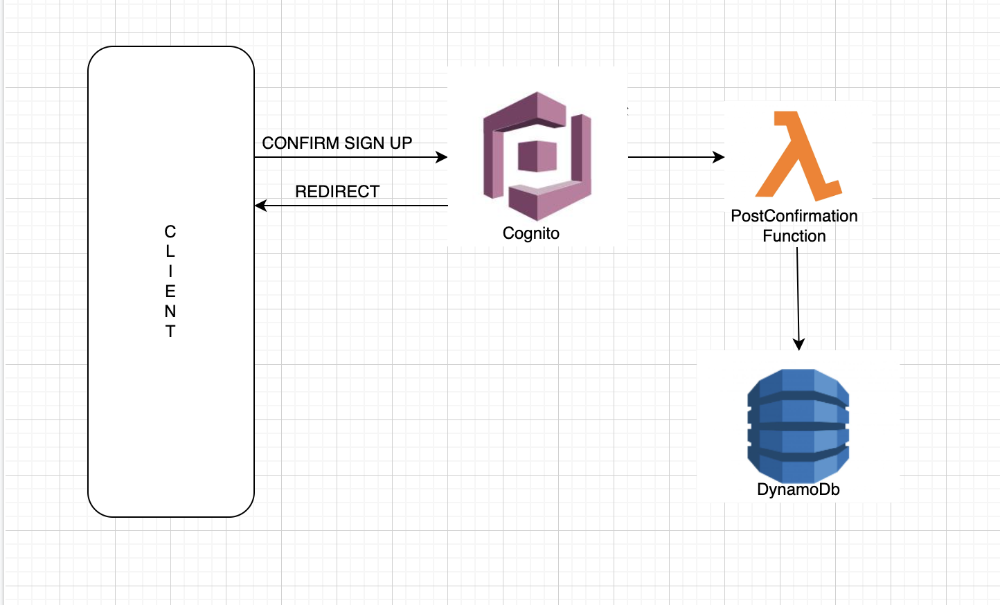

AWS Lambda examples with implementation in Java. 
Some services:
S3, Dynamo DB, SNS, API Gateway REST, API Gateway WebSocket,

Architecture diagram:

WebSocket flow:

Cognito Post Confirmation Trigger:

